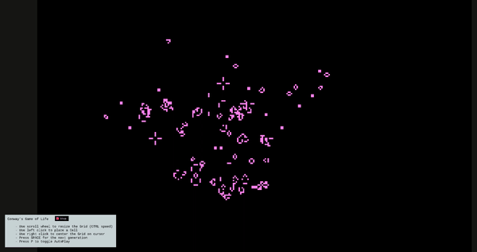

# Game of Life in C

A simple recreation of [Conway's Game Of Life](https://en.wikipedia.org/wiki/Conway%27s_Game_of_Life) in pure C using the wonderful graphics library [raylib](https://www.raylib.com/).

This is a homage to one of my very first projects in C so enjoy.

